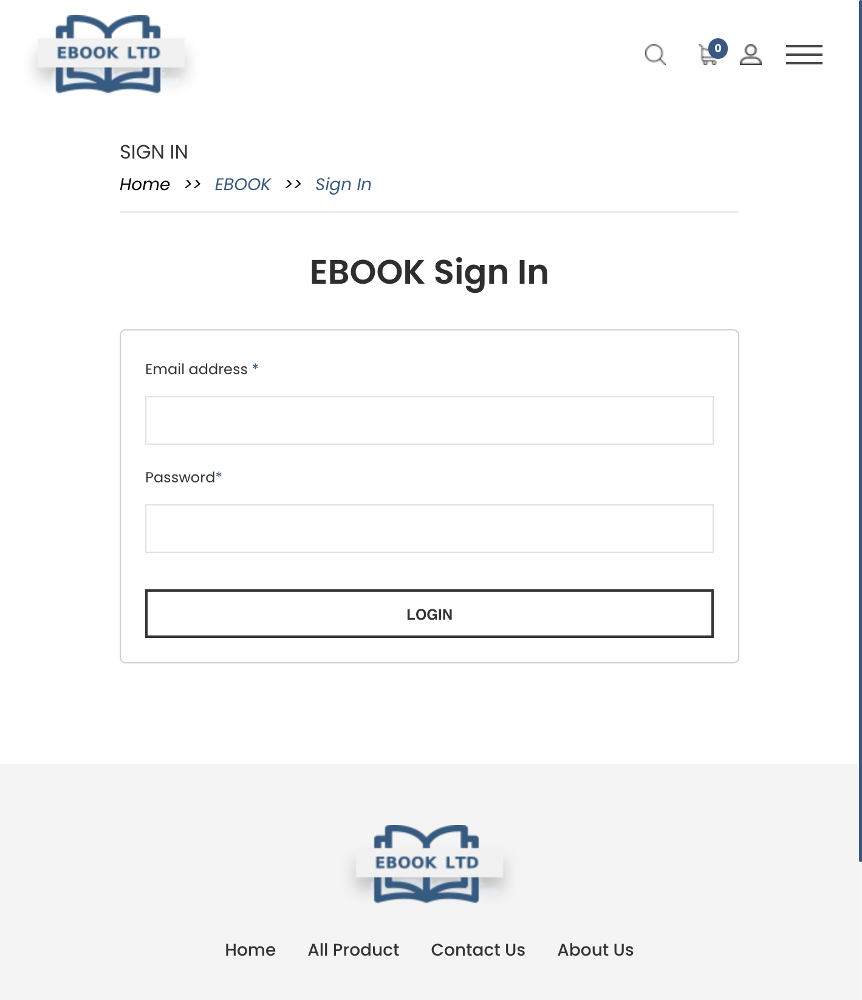
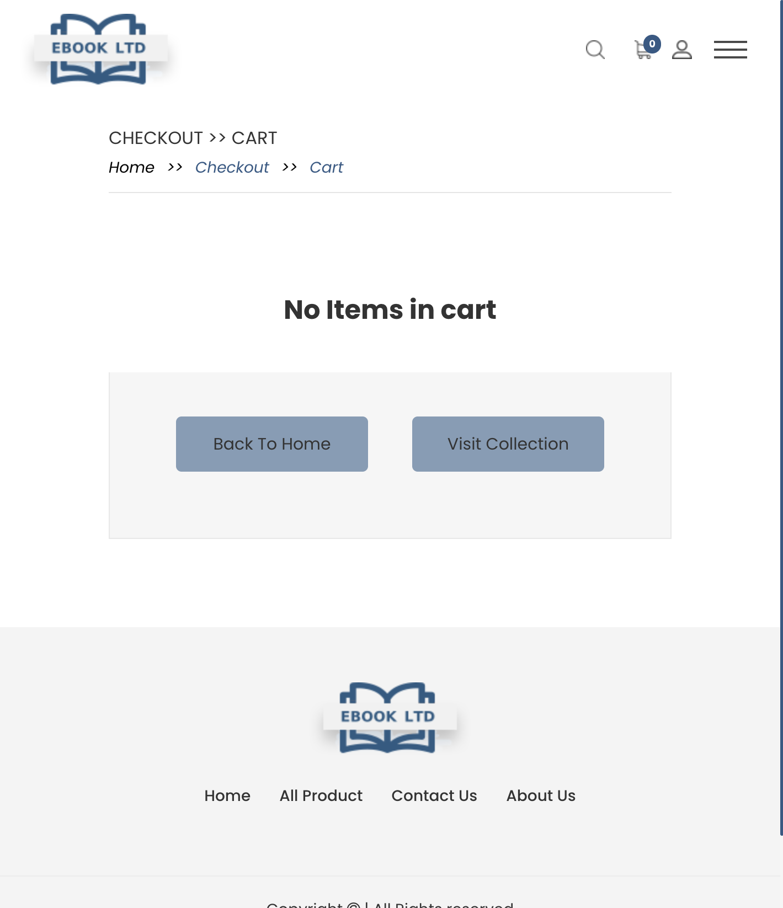
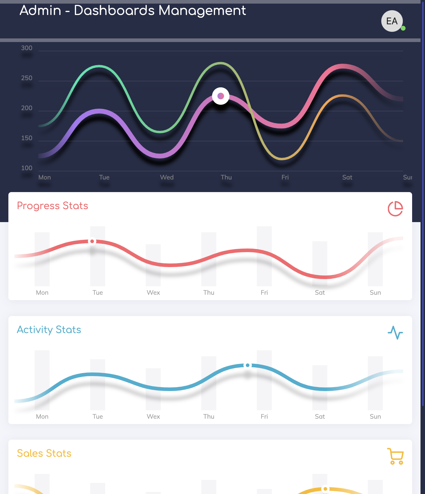
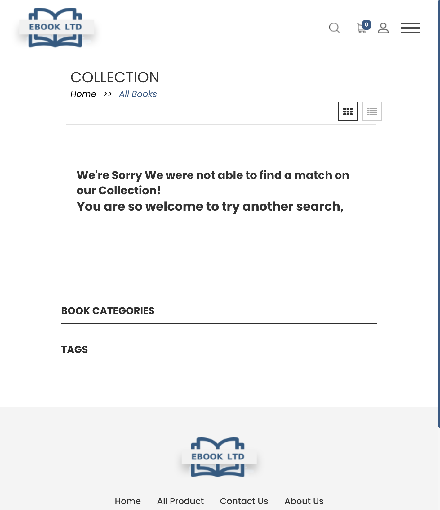
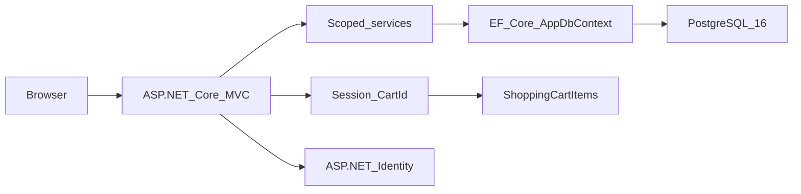

# EbookLtd

**EbookLtd** is an open-source e-commerce web application for selling and managing books, built with **ASP.NET Core** on **.NET 10**, **Entity Framework Core**, and **PostgreSQL 16**.

It is a single-process, server-rendered bookstore: a public storefront where customers browse a catalog, add titles to a cart, and place orders, plus a role-gated admin area where staff manage books, writers, publishers, orders, and users. The project is a practical reference implementation of a monolithic ASP.NET Core MVC app with cookie-based authentication, a hybrid session/database shopping cart, and EF Core migrations against PostgreSQL.

- **Live demo:** [https://ebook-dotnet.alwis.dev](https://ebook-dotnet.alwis.dev)
- **Source:** [github.com/alwismt/EbookLtd](https://github.com/alwismt/EbookLtd)
- **License:** [MIT](LICENSE)

---

## Features

### Storefront

The public site is built with Razor views and a custom Bootstrap storefront theme. Customers can:

- **Browse the home page** (`/`) with a hero carousel, latest products, and a featured book section.
- **Shop the full catalog** at `/collection` with text search, category filtering, and pagination (18 books per page).
- **View book details** at `/book/{slug}` — cover image, description, price in Sri Lankan Rupees (Rs), linked writers and publisher, category, and quantity selector.
- **Manage a shopping cart** at `/cart`. Cart state uses a session GUID persisted to the `ShoppingCartItems` table, so line items survive server restarts while the session cookie is valid.
- **Check out** at `/checkout`. Guest checkout creates an ASP.NET Identity account with the `User` role; logged-in customers reuse profile address fields. Checkout captures a shipping address and shows payment options (direct bank transfer, cash on delivery) as **informational UI only** — there is no integrated payment gateway.
- **View order confirmation** at `/order/invoice?orderid=` and **order history** at `/myorders` (requires the `User` role).
- **Sign in** at `/login` with cookie authentication.
- Visit static **About Us** (`/aboutus`) and **Contact Us** (`/contactus`) pages.

Books can be organized into categories such as Fiction, Fantasy, Mystery, Biography, Business, History, Romance, Science, Kids, and others (21 categories defined in `ecom/Data/Enums/BookCategory.cs`).

### Admin back office

All admin routes live under `/admin` and require the **Admin** role (`[Authorize(Roles = "Admin")]`). Administrators can:

- View a **dashboard** at `/admin/dashboard` (Chameleon admin theme with chart placeholders).
- **Create, edit, and delete books** at `/admin/books` — including cover image upload to `wwwroot/images/books/`, URL slug validation via AJAX, and many-to-many writer assignment.
- **Manage writers** at `/admin/writers` — name, photo (`wwwroot/images/actors/`), and biography.
- **Manage publishers** at `/admin/publishers` — name and biography.
- **View orders** at `/admin/orders` (read-only list with line items and totals).
- **View registered users** at `/admin/users` (read-only list).

On first startup the app seeds an admin account (see [Database seeding](#database-seeding)). The seed does **not** include sample books — the catalog is populated through the admin UI or an existing database.

### What this app is not

EbookLtd manages a **book catalog with cart and order records**. It does not deliver digital ebook files, enforce DRM, track inventory levels, send email notifications, or process online payments. Payment method radios on the checkout page are display-only.

---

## Screenshots

| Storefront home | Shop / collection |
|---|---|
|  |  |

| Login | Shopping cart |
|---|---|
|  |  |

| Admin dashboard | Admin books |
|---|---|
|  |  |

Explore the full experience on the [live demo](https://ebook-dotnet.alwis.dev). Admin login: **admin@ebook.lk** / **Ebook@1234**.

---

## Architecture

EbookLtd is a **monolithic ASP.NET Core MVC** application. A single `ecom` web project handles HTTP requests, renders Razor views, and talks to PostgreSQL through EF Core. There is no separate API layer, microservice, or background worker.



### Layers

| Layer | Location | Role |
|-------|----------|------|
| Controllers | `ecom/Controllers/` | HTTP routing, authorization, view selection |
| Views | `ecom/Views/` | Razor templates — storefront (`Shared/Front/`) and admin (`Shared/Admin/`) |
| Models | `ecom/Models/` | EF entities and `ApplicationUser` |
| Services | `ecom/Data/Services/` | Domain logic — books, writers, publishers, orders |
| Repository base | `ecom/Data/Base/` | Generic `EntityBaseRepository<T>` for CRUD |
| DbContext | `ecom/Data/AppDbContext.cs` | EF Core context extending `IdentityDbContext` |
| Cart | `ecom/Data/Cart/ShoppingCart.cs` | Session GUID + DB-backed line items |
| View models | `ecom/Data/ViewModels/` | Login, registration, checkout, cart DTOs |

Services are registered as scoped in [`Program.cs`](ecom/Program.cs). Authentication uses **ASP.NET Core Identity** with cookie sessions. The shopping cart stores a GUID in ASP.NET session and persists items in the `ShoppingCartItems` table.

There is **no REST API**. The only non-HTML endpoint is a JSON slug-check action used by the admin book form (`POST /admin/bookurl/slugcheck/{slug}`).

### Domain model

| Entity | Table | Description |
|--------|-------|-------------|
| `Book` | `Books` | Title, slug, description, price, cover image, category, publish date |
| `Writter` | `Writters` | Writer name, photo, biography (note: the codebase uses the spelling `Writter`) |
| `Writter_Book` | `Writter_Books` | Many-to-many join between books and writers |
| `Publisher` | `Publishers` | Publisher name and biography |
| `Order` | `Orders` | Order header linked to a user |
| `OrderItem` | `OrderItems` | Line item with quantity and price-at-order-time |
| `Address` | `Addresses` | Shipping address snapshot per order |
| `ShoppingCartItem` | `ShoppingCartItems` | Cart line item keyed by session cart ID |
| `ApplicationUser` | `AspNetUsers` | Identity user with name, address, and phone fields |

Standard ASP.NET Identity tables (`AspNetRoles`, `AspNetUserRoles`, etc.) are also present.

### Roles

| Role | Access |
|------|--------|
| `Admin` | Full back-office access under `/admin` |
| `User` | Customer checkout, order history, and invoice pages |

Defined in [`ecom/Data/Static/UserRoles.cs`](ecom/Data/Static/UserRoles.cs).

---

## Tech stack

| Component | Version |
|-----------|---------|
| .NET | 10.0 (`net10.0`) |
| ASP.NET Core MVC | Server-rendered Razor views |
| Entity Framework Core | 10.0.11 |
| PostgreSQL provider | Npgsql.EntityFrameworkCore.PostgreSQL 10.0.3 |
| ASP.NET Core Identity | 10.0.11 |
| Database | PostgreSQL 16 |

---

## Getting started

### Prerequisites

- [.NET 10 SDK](https://dotnet.microsoft.com/download/dotnet/10.0)
- [PostgreSQL 16](https://www.postgresql.org/download/)

Confirm the SDK:

```bash
dotnet --version
# Should report 10.x
```

### PostgreSQL setup

Create a database user and database matching the default connection string:

```sql
CREATE USER ad_book WITH PASSWORD 'password';
CREATE DATABASE ad_book OWNER ad_book;
```

Adjust the username, password, host, and database name to match your environment.

### Configuration

The app reads settings from `ecom/appsettings.json` and environment-specific overrides. The only required setting for a working deployment is the database connection string.

**Option A — `appsettings.json`**

Edit [`ecom/appsettings.json`](ecom/appsettings.json) and replace `YOUR_PASSWORD`:

```json
"ConnectionStrings": {
  "DefaultConnection": "Host=127.0.0.1;Port=5432;Database=ad_book;Username=ad_book;Password=YOUR_PASSWORD;Timeout=5"
}
```

**Option B — User secrets (recommended for local development)**

```bash
dotnet user-secrets init --project ecom/ecom.csproj
dotnet user-secrets set "ConnectionStrings:DefaultConnection" \
  "Host=127.0.0.1;Port=5432;Database=ad_book;Username=ad_book;Password=password" \
  --project ecom/ecom.csproj
```

**Production environment variable:**

```bash
export ConnectionStrings__DefaultConnection="Host=db.example.com;Port=5432;Database=ad_book;Username=ad_book;Password=secret;Timeout=5"
```

Other configuration keys:

| Key | Purpose |
|-----|---------|
| `Logging:LogLevel` | Console log verbosity |
| `AllowedHosts` | Host filtering (`*` by default) |
| `ASPNETCORE_ENVIRONMENT` | `Development` or `Production` |

HTTPS redirection is currently commented out in [`Program.cs`](ecom/Program.cs); enable it or terminate TLS at a reverse proxy in production.

### EF Core tools

Install the global EF Core CLI matching the project version:

```bash
dotnet tool install --global dotnet-ef --version 10.0.11
```

If already installed at a different version:

```bash
dotnet tool update --global dotnet-ef --version 10.0.11
```

### Migrations

Schema changes are managed with EF Core migrations in [`ecom/Migrations/`](ecom/Migrations/). Migrations are **not** applied automatically at startup — run them explicitly:

```bash
dotnet restore ecom/ecom.csproj
dotnet ef database update --project ecom/ecom.csproj
```

Migration history:

| Migration | Purpose |
|-----------|---------|
| `20220329135332_Initial` | Core catalog tables — publishers, writers, books, join table |
| `20220408165229_Order_OrderItems_Added` | Orders, order items, book slug and price type changes |
| `20220408165933_ShoppingCartItem_Added` | Shopping cart items table |
| `20220410130201_identityUser` | ASP.NET Identity schema and user address fields |
| `20220410130524_identity_added` | User first/last name columns |
| `20220410193711_identityUser_update1` | Remove unused City column |
| `20220411113824_Address_Keys` | Order shipping address table |

To create a new migration after model changes:

```bash
dotnet ef migrations add YourMigrationName --project ecom/ecom.csproj
```

### Run locally

From the repository root:

```bash
dotnet run --project ecom/ecom.csproj
```

Open [http://localhost:5000](http://localhost:5000) or [http://localhost:7290](http://localhost:7290) (see [`launchSettings.json`](ecom/Properties/launchSettings.json)).

### Database seeding

On startup, [`AppDBInitializer`](ecom/Data/AppDBInitializer.cs) creates the `Admin` and `User` roles and an admin account if one does not exist:

| Field | Value |
|-------|-------|
| Email | `admin@ebook.lk` |
| Username | `admin` |
| Password | `Ebook@1234` |
| Role | Admin |

After the first run, sign in at `/login` and go to `/admin/dashboard` to add publishers, writers, and books.

---

## Deployment

There is no Docker or CI configuration in the repository. A typical production deployment:

1. **Publish** the app:

   ```bash
   dotnet publish ecom/ecom.csproj -c Release -o ./publish
   ```

2. **Provision PostgreSQL 16** reachable from the host.

3. **Set the connection string** via environment variables or your hosting platform's secret store — never commit production passwords.

4. **Apply migrations** against the production database:

   ```bash
   dotnet ef database update --project ecom/ecom.csproj \
     --connection "Host=...;Database=ad_book;Username=...;Password=..."
   ```

5. **Run** the published assembly (`dotnet ecom.dll`) behind a reverse proxy (nginx, IIS, Caddy, etc.) and enable HTTPS at the proxy layer.

6. **Upload directories** — book covers and writer photos are stored on the local filesystem under `wwwroot/images/books/` and `wwwroot/images/actors/`. Ensure these directories are writable and persisted across deployments.

The [live demo](https://ebook-dotnet.alwis.dev) is an example of this stack in production.

---

## Application structure

```
EbookLtd/
├── EbookLtd.slnx          # Solution file
├── LICENSE
├── README.md
├── docs/
│   └── screenshots/       # UI screenshots for documentation
└── ecom/                  # ASP.NET Core web application
    ├── Program.cs         # App startup, DI, middleware
    ├── ecom.csproj
    ├── appsettings.json
    ├── Controllers/       # MVC controllers (storefront + admin)
    ├── Models/            # EF entities
    ├── Data/
    │   ├── AppDbContext.cs
    │   ├── AppDBInitializer.cs
    │   ├── Base/          # Generic repository
    │   ├── Cart/          # Shopping cart logic
    │   ├── Enums/         # BookCategory
    │   ├── Services/      # Domain services
    │   ├── Static/        # Role constants
    │   ├── ViewComponents/
    │   └── ViewModels/
    ├── Migrations/        # EF Core migrations
    ├── Views/             # Razor views
    └── wwwroot/           # Static assets (CSS, JS, images, admin theme)
```

### Route reference

**Storefront**

| Method | Route | Description |
|--------|-------|-------------|
| GET | `/` | Home page |
| GET | `/collection` | Shop — search, filter, paginate |
| GET | `/book/{slug}` | Book detail |
| GET | `/cart` | Shopping cart |
| GET | `/addtoshoppingcart?id=&qty=` | Add item to cart |
| GET | `/removecartitems/?id=&qty=` | Remove item from cart |
| GET | `/checkout` | Checkout form |
| POST | `/order/checkout` | Place order (guest — creates account) |
| POST | `/order/checkout/user` | Place order (logged-in user) |
| GET | `/order/invoice?orderid=` | Order confirmation |
| GET | `/myorders` | Order history (User role) |
| GET | `/login` | Sign in |
| POST | `/logout` | Sign out |
| GET | `/aboutus` | About page |
| GET | `/contactus` | Contact page |

**Admin** (requires Admin role)

| Method | Route | Description |
|--------|-------|-------------|
| GET | `/admin/dashboard` | Dashboard |
| GET | `/admin/books` | List books |
| GET/POST | `/admin/book/create`, `/admin/book/add` | Create book |
| GET/POST | `/admin/book/edit/{slug}`, `/admin/book/add/{id}` | Edit book |
| POST | `/admin/bookurl/slugcheck/{slug}` | Slug availability (JSON) |
| GET | `/book/delete/{id}` | Delete book |
| GET/POST | `/admin/writers`, `/admin/writer/*` | Writer CRUD |
| GET/POST | `/admin/publishers`, `/admin/publisher/*` | Publisher CRUD |
| GET | `/admin/orders` | List orders |
| GET | `/admin/users` | List users |

---

## License

This project is licensed under the **MIT License**.

Copyright (c) 2022 Alwis

See [LICENSE](LICENSE) for the full text.
